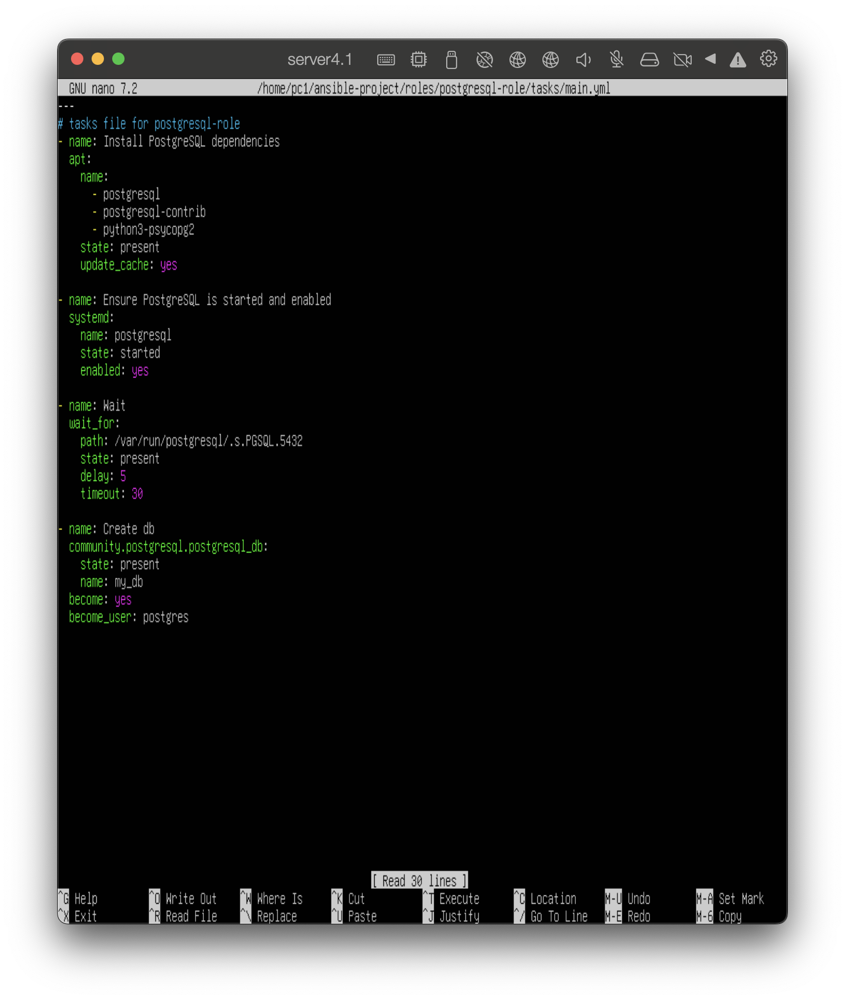

# Система управления конфигурациями

### Настройка SSH сервера (на ВМ1)
Необходимо запустить ssh севрер: 
`sudo systemctl enable ssh`
`sudo systemctl start ssh`

и создать ключ:
`ssh-keygen -t rsa -b 4096 -C "pc1@server1"`

-t тип ключа, указываем алгоритм RSA

-b размер ключа в битах
> -C - комментарий для собственного удобства

Далее копируем SSH ключ на ВМ2 командой `ssh-copy-id pc2@10.211.55.26`

- pc2 - username ВМ2
- 10.211.55.26 - ip ВМ2 (не настраивался, dchp сервер назначил автоматически)

Теперь с ВМ1 можем подключиться к ВМ2

На ВМ1 устанавливаем ansible

### Настройка ansible
Для подключения ВМ1 и ВМ2 к управлению через сервер ansible cоздаем директорию и файл инвентаря:
`sudo mkdir -p /etc/ansible`
`sudo nano /etc/ansible/hosts`

Две группы хостов:
- ansible_servers относится ВМ1, команды выполняются локально
- managed_vm относится ВМ2, подключаемся по ssh как пользователь pc2, используя ssh ключ

Объеденены в группу vm_group.

Проверяем доступность хостов: `anbsible all -m ping`

### Написание плейбуков
Плейбук для установки пакетов

В качестве целевых хостов указываем все из инвентаря.
Повышаем права (sudo).
Указываем необходимые пакеты для установки на каждый хост в переменных.
В блоке задач указываем имя задачи (установка пакетов apt).
При необходимости установить на определенные хосты используеься `when: inventory_hostname in groups['group_name']`, где `group_name` название группы хостов, к которой будет применяться задача, также указываем нужные пакеты.

#### Роль для установки БД
Инициализируем роль: `ansible-galaxy init postgresql-role`

Настраиваем роль:

Прописаны необходимые задачи:
1) установка PostgreSQL
2) указана автозагрузка, и сервис запущен
3) ожидание подключения (не обязательно)
4) создание бд (использовался модуль community.postgresql.postgresql_db)

В директории handlers настраиваем перезагрузку, только в случае изменения устанавливаемого пакета (строчка `nootiify: restart postgresql`)

#### Роль для установки Nginx
Создаем роль:

Аналогично с postgresql.
Создаем веб-директорию, и создаем файл с указанием имени хоста через переменную.

Аналогично с postgresql пишем handlers/main.yml

Надо написать основной плейбук для развертывания ролей:

Запускаем

Проверяем создание БД

Проверяем доступность Nginx

#### Готовая роль из Ansible Galaxy
Был выбран `geerlingguy.docker`

(Лучше дополнительно указать директорию установки роли -> ключ -p)

Создаем плейбук. 
Устанавливать будем только на ВМ2:

После установки, можем проверить `sudo systemctl status docker` на ВМ2, сервис будет доступен.

