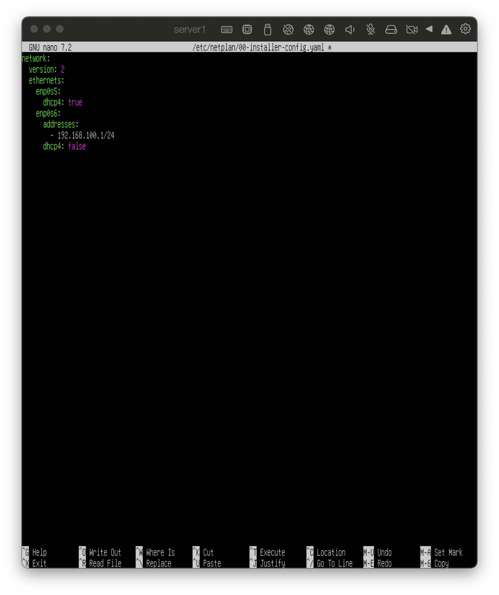
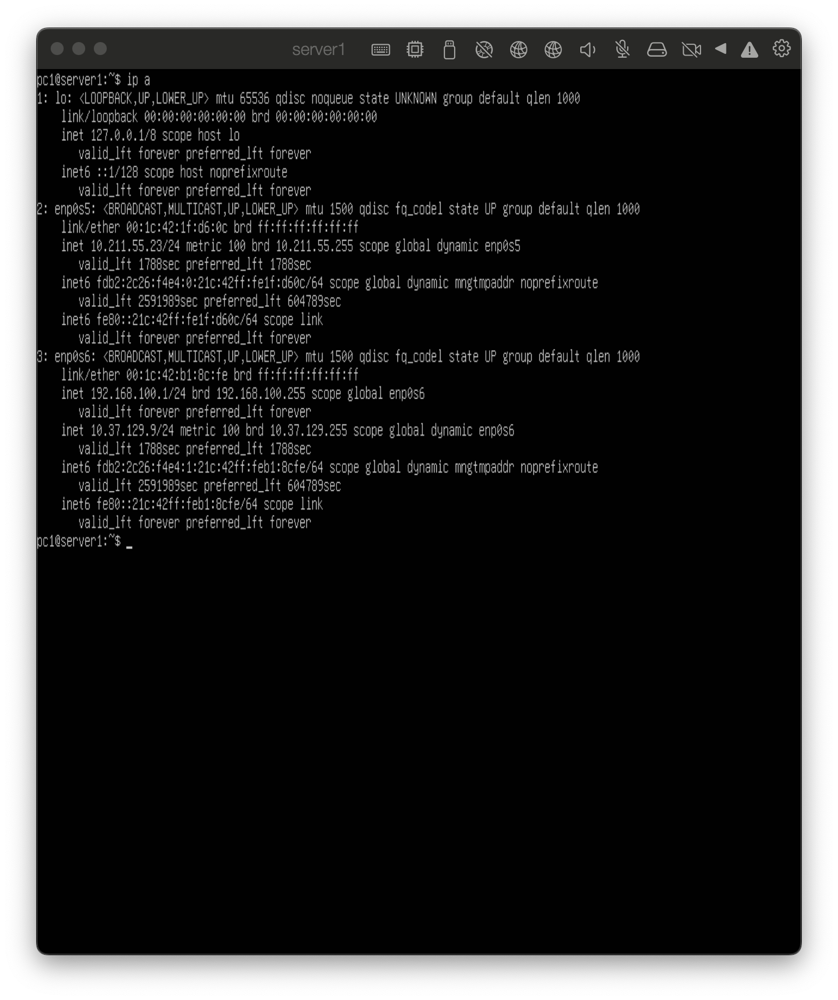
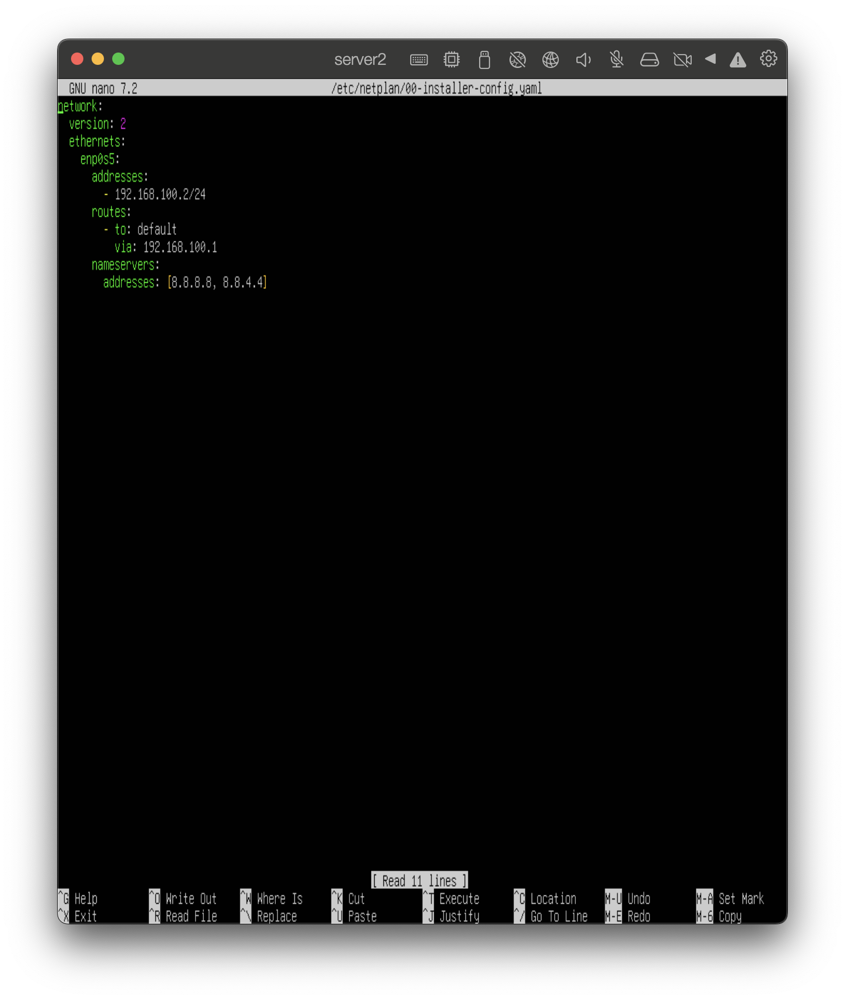
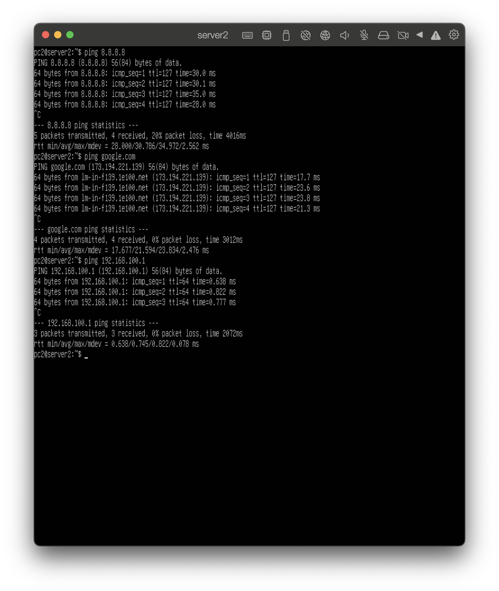
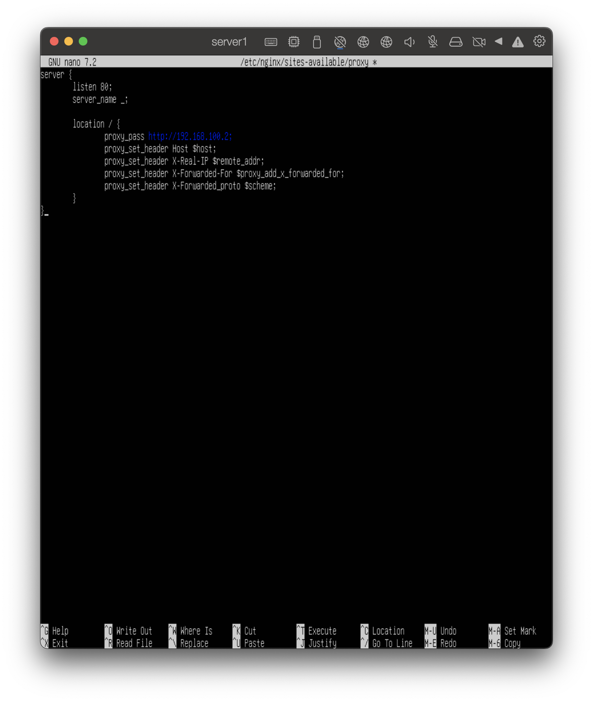
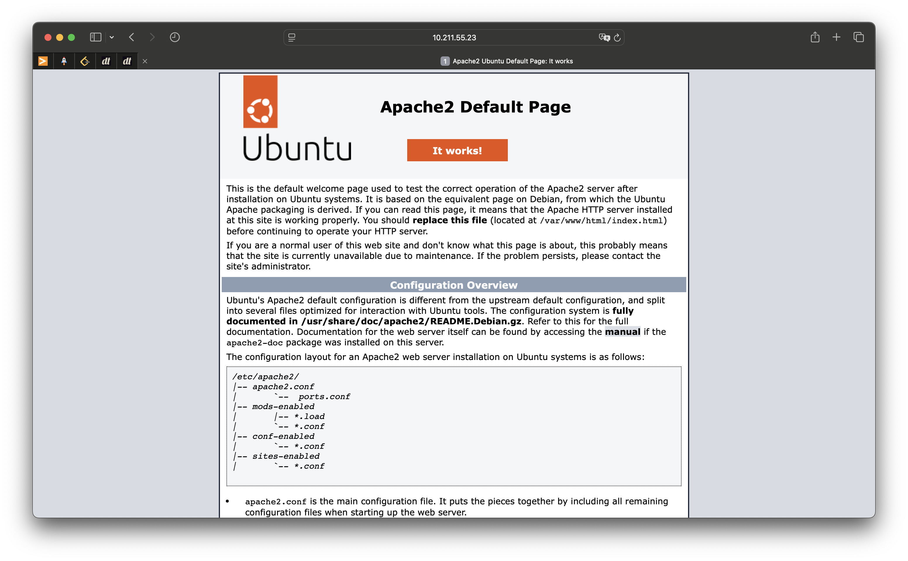
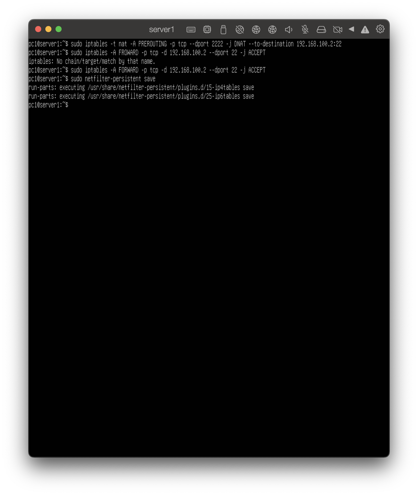
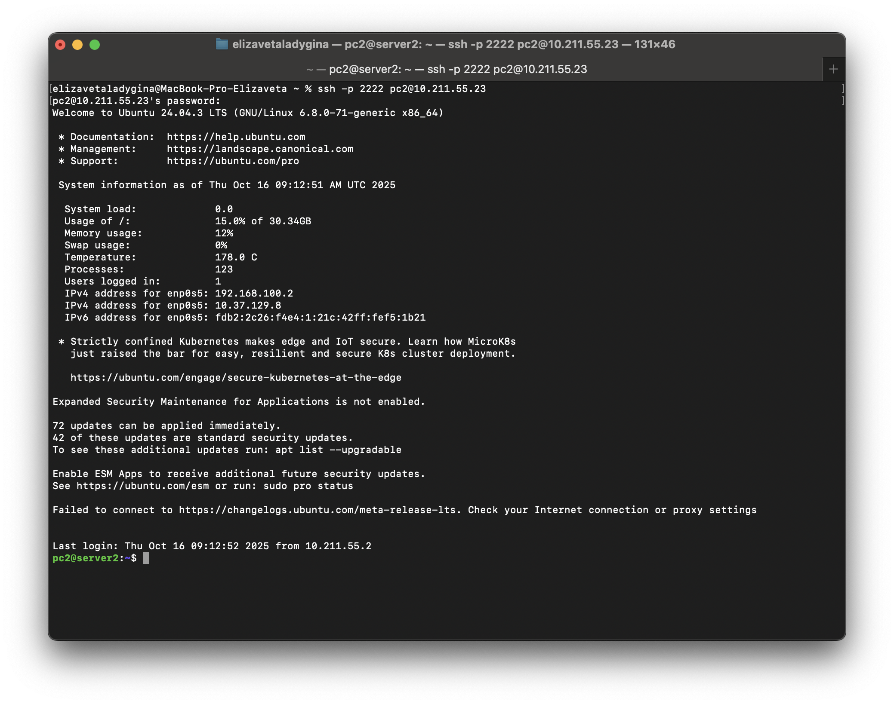

# Настройка сетевой инфраструктуры и сервисов на виртуальных машинах

## Задание №1. Сетевые настройки
### Настройка ВМ1
Определяем интерфейсы WAN и LAN: `ip a`

В моем случае WAN интерфейс - enp0s5, а LAN - enp0s6

#### Форвардинг пакетов
Необходимо включить форвардинг пакетов: `sudo nano /etc/sysctl.conf`

Строка `net.ipv4.ip_forward=1`

Применить изменения:
`sudo sysctl -p`

#### Настройка пограничного маршрутизатора (ВМ1):
Создаем файл конфигурации: `sudo nano /etc/netplan/00-installer-config.yaml`


 
Для WAN 

dhcp4: true – интерфейс получит IP-адрес автоматически через DHCP-сервер.

Для LAN

Вручную задаем статический IP-адрес 192.168.100.1/24 и отключаем DHCP-клиент

ВМ2 использует ВМ1 (192.168.100.1) как шлюз, чтобы выйти в интернет.

Применить изменения: `sudo netplan apply`

После применения изменений:



#### На ВМ2:
Создаем файл конфигурации: `sudo nano /etc/netplan/00-installer-config.yaml`


 
Вручную задаем статический IP-адрес для ВМ2 - 192.168.100.2/24

Устанавливаем маршрут по умолчанию с указанием ВМ1 (192.168.100.1) в качестве шлюза (отправка трафика ВМ2 в интернет через ВМ1)

Разрешаем доменные имена (для доступа google.com)

Применить настройки: `sudo netplan apply`


### Настройка NAT на ВМ1:

```
sudo iptables -t nat -A POSTROUTING -o enp0s5 -j MASQUERADE
sudo iptables -A FORWARD -i enp0s6 -o enp0s5 -j ACCEPT
sudo iptables -A FORWARD -i enp0s5 -o enp0s6 -m state --state RELATED,ESTABLISHED -j ACCEPT
```


1) Таблица nat, добавляем правило для изменения пакетов после маршрутизации, применяем к интерфейсу, который выходит в интернет (enp0s5)
подменяет ip-адреса всех пакетов, выходящих из интерфейса enp0s6, на ip интрефейса enp0s5 => реализует статический NAT
```
Когда ВМ2 (192.168.100.2) отправляет запрос в интернет, пакеты проходят через ВМ1 (192.168.100.1). NAT меняет исходный IP-адрес с 192.168.100.2 на внешний IP ВМ1 (полученный через enp0s5). Интернет-сервера будут видеть запрос как будто от ВМ1, а не от ВМ2.
```

2) разрешение перессылки пакетов от ВМ2 в интернет. Пакеты приходят с LAN-интерфейса и отправляются через WAN-интерфейс

3) разрешение обратного трафика (только ответные пакеты из интернета)


Сохраняем и применяем правила iptables:
```
sudo netfilter-persistent save
sudo netfilter-persistent reload
```

На ВМ2 проверяем доступ к интернету: `ping 8.8.8.8`



## Задание №2
Устанавливаем nginx на ВМ1, apache на ВМ2.

Разрешить Apache в фаерволе:
`sudo ufw allow 80/tcp`

На ВМ1 создаем конфигурацию для проксирования:


Принимает запросы для любого домена/ip.
Запросы перенаправляются на Apache на ВМ2.

Создать символическую ссылку на новую конфигурацию в директории активных конфигураций:
`sudo ln -s /etc/nginx/sites-available/proxy /etc/nginx/sites-enabled/`

Удалить дефолтную конфигурацию:
`sudo rm /etc/nginx/sites-enabled/default`

Перезапустить Nginx:
`sudo systemctl restart nginx`

Разрешить Nginx в фаерволе:
`sudo ufw allow 80/tcp`

Добавить правило для входящего трафика на порт 80:
`sudo iptables -A INPUT -p tcp --dport 80 -j ACCEPT`

Сохранить правила:
`sudo netfilter-persistent save`

С хостового пк:


## Задание №3
Необходимо на ВМ1 добавить правила для проброа 2222 порта на порт 22 в ВМ2:


С хостового пк выполняем:


Как происходит:
1) Пакет прходит на WAN ВМ1 на порт 2222
2) DNAT меняет 192.168.100.1:2222 на 192.168.100.2:22
3) Правило FORWARD разрешает передачу пакета на ВМ2
4) ВМ2 получает ssh-запрос на порт 22
5) ОТветный трафик идет через RELATED,ESTABLISHED правила (настройка из первого задания)